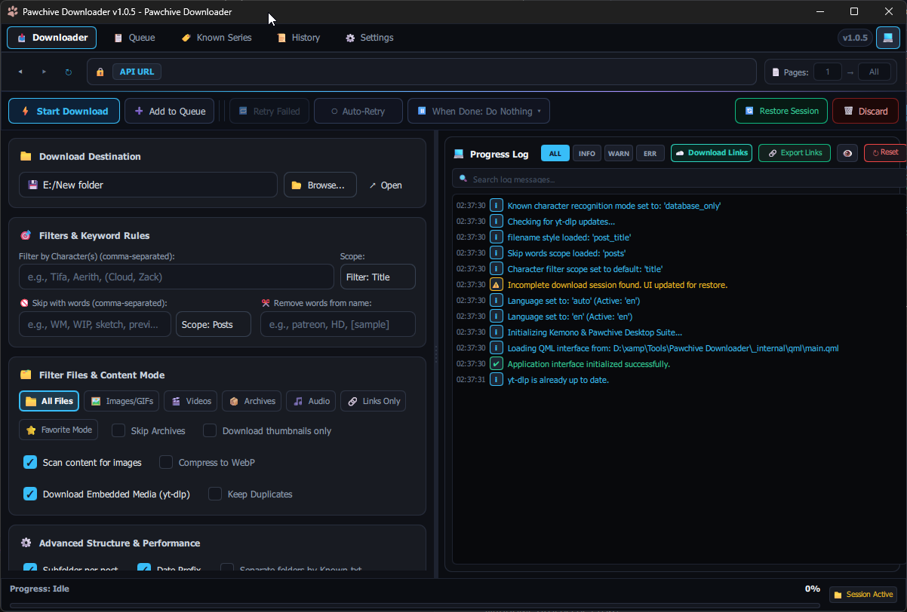
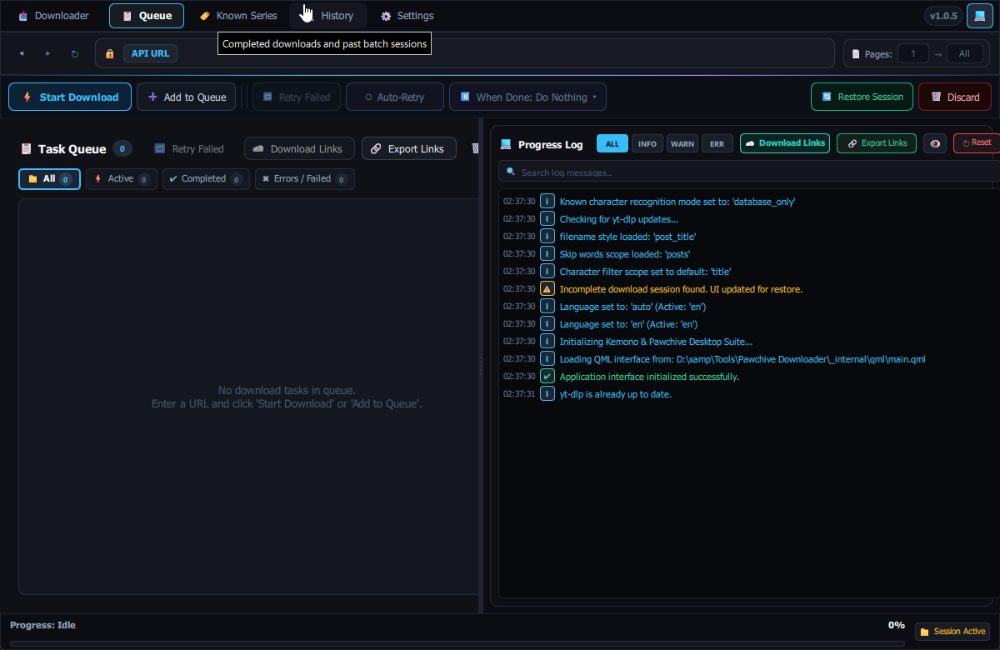
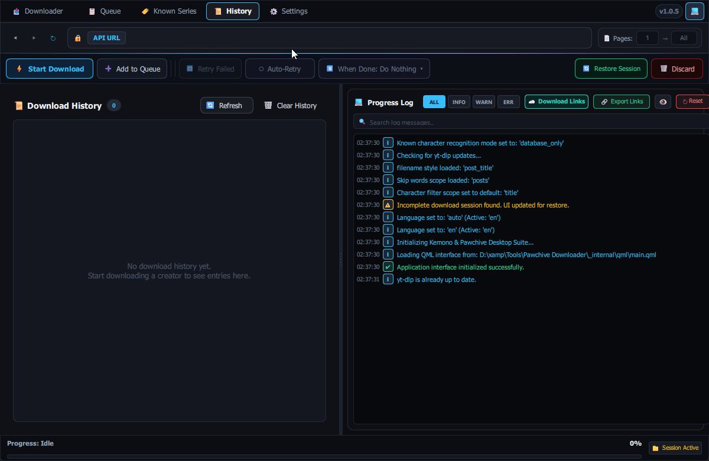
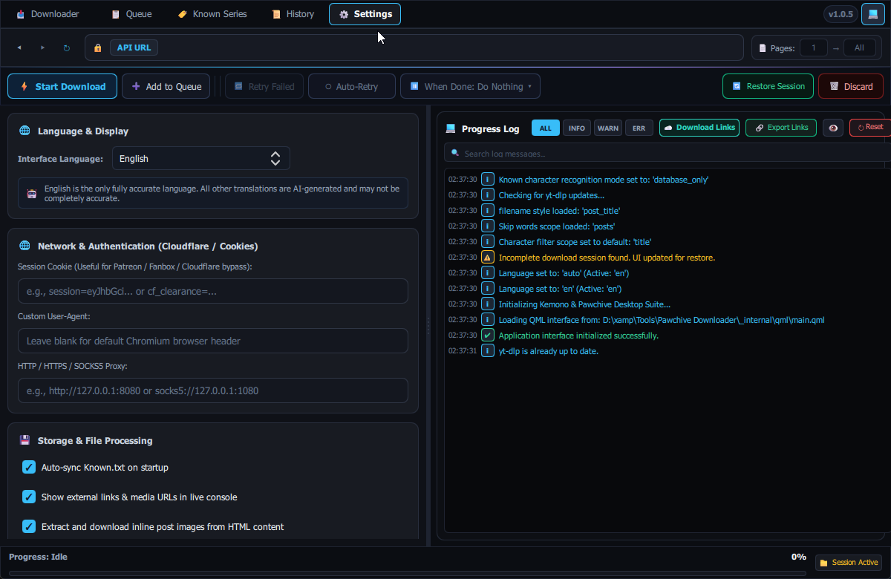
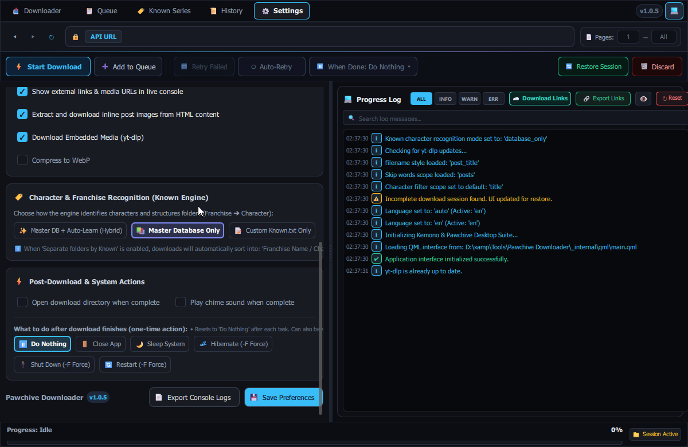

# Pawchive Downloader

<p align="center">
  
</p>

<p align="center">
  <strong>A modern, high-speed desktop media archiver and downloader for Pawchive, Kemono, Coomer, and external cloud hosts.</strong><br>
  Built with Python, PySide6, and modern reactive QML.
</p>

<p align="center">
  <a href="https://github.com/whyamihere773/Pawchive-Downloader/releases/latest"></a>
  <a href="https://github.com/whyamihere773/Pawchive-Downloader/releases"></a>
  
  
</p>

<p align="center">
  <a href="https://github.com/whyamihere773/Pawchive-Downloader/releases/latest">
    
  </a>
</p>

<p align="center">
  <em>(Portable — no Python or command-line setup required! Just extract and run <code>Pawchive Downloader.exe</code>)</em>
</p>

---

## 📸 Interface Preview

<p align="center">
  
</p>

<details>
<summary><strong>🖼️ Click to expand more interface screenshots</strong></summary>
<br>

### Task Queue & Batch Actions


### Download History & Archive Records


### Settings: Multi-Language & Network Authentication


### Settings: Franchise & Known Character Engine


</details>

---

## ✨ Key Features

- ⚡ **Adaptive Multi-Threaded Engine:** Parallel chunked downloads with dynamic concurrency scaling and manual thread-locking.
- 🌐 **Full 14-Language Localization (i18n):** Instant in-app language switching and real-time dynamically translated console activity logs (English, Chinese, Japanese, Korean, Spanish, French, German, Russian, Portuguese, and more).
- 🔓 **Built-in Cloud Decryptor:** Downloads and decrypts entire **Mega** folders directly with client-side AES decryption, plus direct streaming for **Google Drive**, **Dropbox**, and **GoFile**.
- 📊 **Active Large File Monitor (≥ 50 MB):** Dedicated real-time monitoring panel displaying individual progress bars, speed, and ETA for large media downloads.
- 🛡️ **SSD Stall & Disk Saturation Protection:** Hardened speed estimation engine prevents freeze glitches and auto-pauses gracefully upon out-of-disk space (`WinError 112` / `Errno 28`) without crashing worker threads.
- 🎯 **Advanced Smart Filtering:** Filter by character names, series, keywords, file categories (images, videos, audio, archives), or minimum file size thresholds.
- 🗂️ **Automated Organization & Franchise Recognition:** Automatically structures downloaded files into clean creator/franchise folders using an integrated franchise database and custom `Known.txt` rules.
- 📖 **Manga & Comic Order:** Chronologically sequences files and folders (`001 - Title`) so chapters stay in proper sequential order in image viewers.
- 🔗 **Link Harvesting & Export:** Extracts external cloud drive links and embedded player URLs from post bodies and comments; download them immediately or export to text files.
- 🎬 **Embedded Player Downloads:** Auto-updating `yt-dlp` integration grabs videos from Vimeo, YouTube, Streamable, RedGifs, Twitter/X, and more.
- 💾 **Session Recovery & Queue Persistence:** Pause and resume transfers anytime. Safely restores interrupted queues after an unexpected shutdown or crash.

---

## 🌐 Supported Platforms & Hosts

### Creator Archives & Portals
- **Pawchive** (`pawchive.pw`)
- **Kemono** (`kemono.su`)
- **Coomer** (`coomer.su`)
- **Cum.st** (`cum.st`)
- *Supported creator services:* Patreon, Pixiv Fanbox, Fantia, Subscribestar, Gumroad, Boosty, Discord, OnlyFans, Fansly, Afdian, DLsite, and more.

### Cloud Drives & Direct Storage
- **Mega** (folders and individual files with automatic AES decryption)
- **Google Drive** (shared files and public folders)
- **Dropbox** (direct download links and auto-extracted archives)
- **GoFile** (direct albums and folders)

### Media Galleries & File Lockers
- **Bunkr**, **Erome**, **nHentai**, **Saint2**, **Pixeldrain**, **Catbox**, **Mediafire**, **SimpCity**

### Video & Stream Embeds
- **YouTube**, **Vimeo**, **Streamable**, **RedGifs**, **Twitter/X**, **Bilibili**, **SoundCloud**, **Dailymotion**

---

## 🚀 Getting Started

### Option A: Pre-compiled Windows Binary (Recommended for most users)

1. Head over to the **[Latest Release](https://github.com/whyamihere773/Pawchive-Downloader/releases/latest)** page.
2. Download `Pawchive-Downloader-v1.0.5-Windows.zip`.
3. Extract the ZIP archive anywhere on your computer.
4. Run `Pawchive Downloader.exe` — that's it!

---

### Option B: Running from Source (Developers)

Ensure you have **Python 3.10 or newer** installed.

1. **Clone the repository:**
   ```bash
   git clone https://github.com/whyamihere773/Pawchive-Downloader.git
   cd Pawchive-Downloader
   ```

2. **Install dependencies:**
   ```bash
   pip install -r requirements.txt
   ```

3. **Run the application:**
   ```bash
   python main.py
   ```

4. **Build a Windows package:**
   ```bash
   python build.py
   ```
   The portable distribution will be output to `dist/Pawchive Downloader/` alongside a compressed release ZIP archive.

---

## 🤝 Contributing & Community

Feedback, bug reports, and pull requests are warmly welcome!
- **Have a suggestion or found a bug?** Please open an **[Issue](https://github.com/whyamihere773/Pawchive-Downloader/issues)**.
- **Want to add a new host or feature?** Fork the repository, create a feature branch, and submit a **Pull Request**.

---

## ⚖️ Disclaimer

This tool is intended strictly for personal archiving and backup purposes. Please respect content creators' terms of service and rights.
