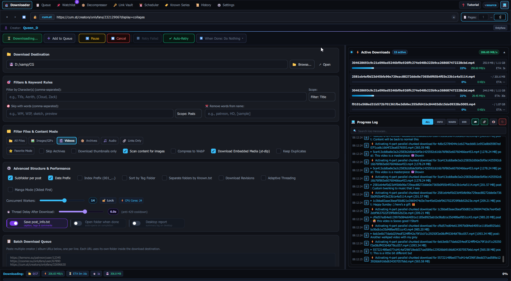
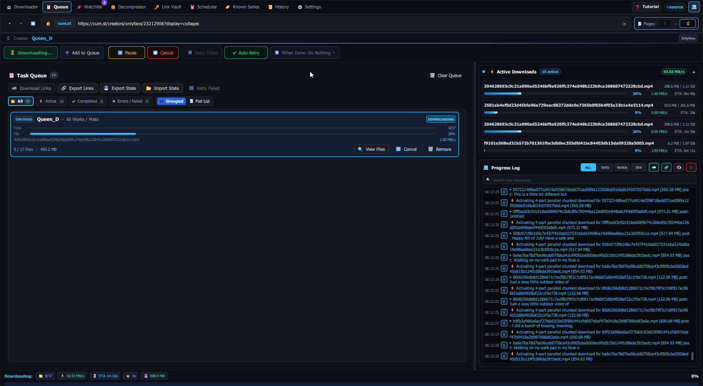
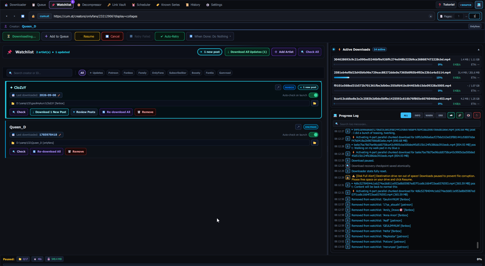
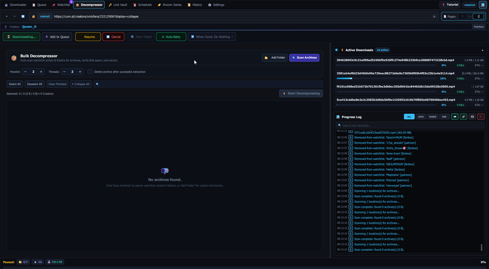
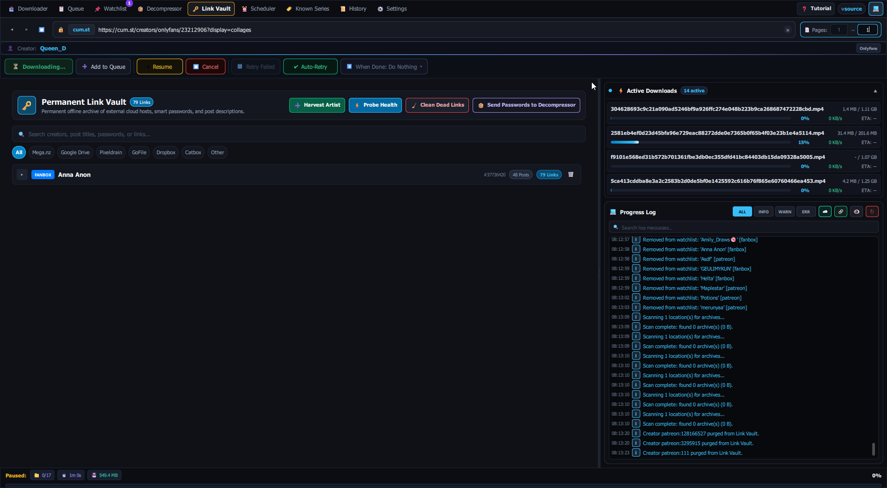
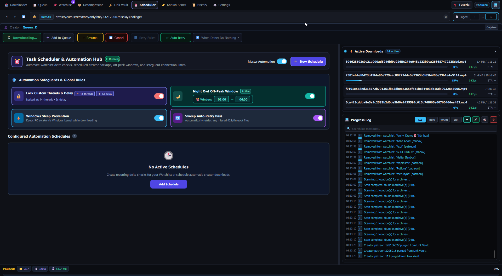
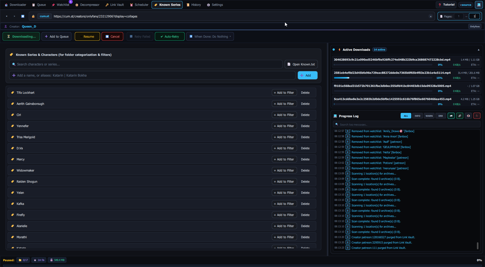
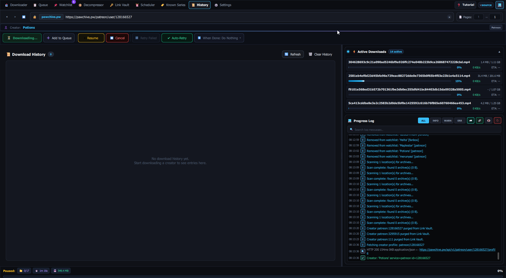
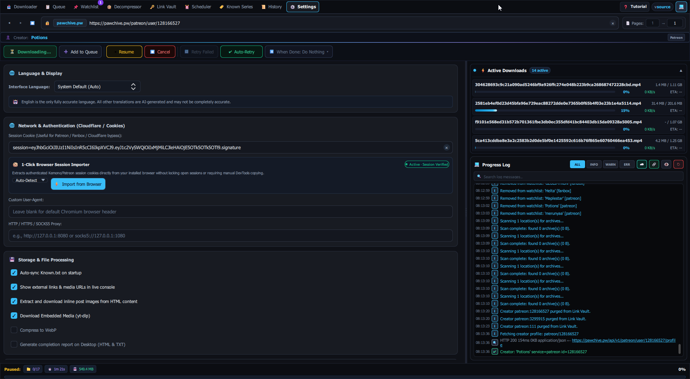
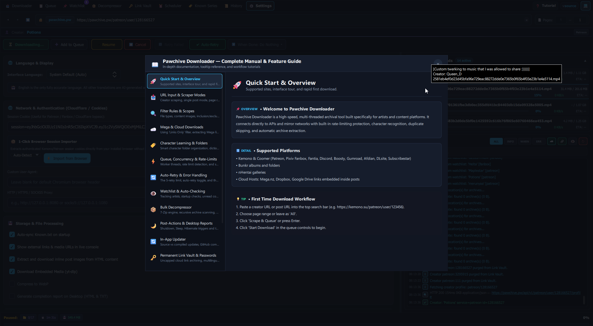

# Pawchive Downloader

<p align="center">
  
</p>

<p align="center">
  <strong>A modern, high-speed desktop media archiver and downloader for Pawchive, Kemono, Coomer, and external cloud hosts.</strong><br>
  Built with Python, PySide6, and modern reactive QML.<br>
  <em>Engineered for maximum automation: hands-off scheduled syncing, permanent link vaulting, multi-drive overflow, and self-healing session recovery.</em>
</p>

<p align="center">
  <a href="https://github.com/whyamihere773/Pawchive-Downloader/releases/latest"></a>
  <a href="https://github.com/whyamihere773/Pawchive-Downloader/releases"></a>
  
  
</p>

<p align="center">
  <a href="https://github.com/whyamihere773/Pawchive-Downloader/releases/latest">
    
  </a>
</p>

<p align="center">
  <em>(Portable — no Python or command-line setup required! Just extract and run <code>Pawchive Downloader.exe</code>)</em>
</p>

---

## 📸 Interface Preview

<p align="center">
  
</p>

<details>
<summary><strong>🖼️ Click to expand more interface screenshots</strong></summary>
<br>











</details>

## ✨ Flagship Highlights (Engineered for Maximum Automation)

> 💡 **Philosophy: Maximum Automation, Minimum Friction**  
> Pawchive Downloader is designed to take the heavy lifting off your hands. You point it at what you want — and it handles the rest: automated schedules, background link harvesting, multi-drive overflow, self-healing recovery, and intelligent file organisation. You stay in control; the app does the work.

- ⏰ **Task Scheduler & Automation Hub:** Create recurring automation schedules to poll your Watchlist for new creator posts, schedule off-peak **Night Owl** download windows, prevent Windows sleep during active jobs, and automatically sweep-retry any rate-limited or dropped files.
- 🗄️ **Permanent Link Vault & Harvester:** Harvests external cloud links (Mega, Google Drive, Pixeldrain, etc.) and archive passwords from posts into a permanent offline vault. Run link health checks, prune dead links, sync passwords to the Decompressor with one click, or harvest entire creator histories without downloading files.
- 💾 **Multi-Drive Storage Pools (Auto-Spanning Overflow):** Never suffer "Disk Full" crashes again. Automatically spills downloads to secondary drives or folders when your primary drive reaches its safety margin, preserving creator and post folder hierarchies seamlessly.
- 📌 **Artist Watchlist:** Track followed creators and automatically check for new posts. Features one-click "Download All Updates", an interactive post review drawer with per-post and bulk ignoring, custom download paths per artist, saved per-artist filter settings, and an editable last-downloaded cutoff date with smart auto-normalization.
- 🧩 **Franchise Recognition Engine:** Automatically structures downloaded files into clean creator/franchise folders using an integrated franchise database and fully customisable `Known.txt` rules — no manual sorting needed.
- 📦 **Universal Bulk Decompressor:** Automated scan across downloaded artists, multi-threaded parallel extraction for `.zip`, `.rar`, `.7z`, multi-part archives, and auto-populated passwords with disk safety checks.
- 🛡️ **Zero-Loss Session Recovery:** If the app is closed, crashed, or cancelled mid-download, atomic checkpoints allow instant one-click resumption right where you left off.
- 🔓 **Client-Side Cloud Decryptor & Modern Host Support:** Native AES client-side decryption for Mega folders, Google Drive full trees with live progress, 1-click browser cookie importer, and rebuilt Bunkr 2026 parallel resolution.

<details>
<summary><strong>🔍 Click to explore all features & tools (25+ capabilities)</strong></summary>
<br>

### 📥 Core Downloading & Performance
- ⚡ **Adaptive Multi-Threaded Engine:** Parallel chunked downloads with dynamic concurrency scaling and manual thread-locking.
- 📊 **Active Large File Monitor (≥ 50 MB):** Dedicated real-time monitoring panel displaying individual progress bars, speed, and ETA for large media downloads.
- 🎬 **Embedded Player Downloads:** Auto-updating `yt-dlp` integration grabs videos from Vimeo, YouTube, Streamable, RedGifs, Twitter/X, and more.
- 🛡️ **SSD Stall & Disk Saturation Protection:** Hardened speed estimation engine prevents freeze glitches and auto-pauses gracefully upon out-of-disk space (`WinError 112` / `Errno 28`) without crashing worker threads.
- ✨ **Fluid Newtonian Smooth Scrolling:** Physics-based kinetic momentum scrolling and velocity accumulation deployed across every view, list, panel, and modal in the UI.

### 🗂️ Smart Organization & Filtering
- 🗂️ **Post-Aware Folder Isolation:** When posts share identical titles or dates, each post is isolated into its own folder (`[post_id]`) so generic filenames (`1.png`, `4.png`) never overwrite or collide.
- 🏷️ **Tag-Based Folder Sorting:** Organise downloads by their primary tag into sub-folders (`Artist / Tag / ...`) so related content stays cleanly grouped.
- 🔢 **Sequential File Indexing:** Files are numbered (`001_`, `002_`, ...) to preserve chronological viewing order without relying on filesystem time sorting.
- 🎯 **Advanced Smart Filtering:** Filter by character names, series, keywords, file categories (images, videos, audio, archives), or minimum file size thresholds.
- 📖 **Manga & Comic Order:** Chronologically sequences files and folders (`001 - Title`) so chapters stay in proper sequential order in image viewers.

### 📊 Auditing, Recovery & Settings
- 📊 **Desktop Completion Reports:** Generates rich visual HTML summaries and plaintext audit reports directly to your Desktop upon download completion (opt-in).
- 📋 **Failed Download Export:** Export a full report of failed files — including direct download links and source post URLs — to a text file for manual auditing.
- 🍪 **1-Click Browser Session Importer:** Extracts authenticated Kemono/Patreon cookies directly from installed browsers without locking open sessions or manual DevTools copying.
- 🌐 **Full 14-Language Localization (i18n):** Instant in-app language switching and real-time dynamically translated console activity logs (English, Chinese, Japanese, Korean, Spanish, French, German, Russian, Portuguese, and more).
- 🔄 **Smart In-App Updater & Standalone Companion (`updater.exe`):** Automatic update alerts on launch with release notes preview and a dedicated standalone companion updater for zero-lock binary updates, seamless extraction, and instant restart.

</details>

---

## 🌐 Supported Platforms & Hosts

### Creator Archives & Portals
- **Pawchive** (`pawchive.pw`)
- **Kemono** (`kemono.su`)
- **Coomer** (`coomer.su`)
- **Cum.st** (`cum.st`)
- *Supported creator services:* Patreon, Pixiv Fanbox, Fantia, Subscribestar, Gumroad, Boosty, Discord, OnlyFans, Fansly, Afdian, DLsite, and more.

### Cloud Drives & Direct Storage
- **Mega** (folders and individual files with automatic AES decryption)
- **Google Drive** (shared files and public folders)
- **Dropbox** (direct download links and auto-extracted archives)
- **GoFile** (direct albums and folders)

### Media Galleries & File Lockers
- **Bunkr**, **Erome**, **nHentai**, **Saint2**, **Pixeldrain**, **Catbox**, **Mediafire**, **SimpCity**

### Video & Stream Embeds
- **YouTube**, **Vimeo**, **Streamable**, **RedGifs**, **Twitter/X**, **Bilibili**, **SoundCloud**, **Dailymotion**

---

## 🚀 Getting Started

### Option A: Pre-compiled Windows Binary (Recommended for most users)

1. Head over to the **[Latest Release](https://github.com/whyamihere773/Pawchive-Downloader/releases/latest)** page.
2. Download `Pawchive-Downloader-v1.1.2-Windows.zip`.
3. Extract the ZIP archive anywhere on your computer.
4. Run `Pawchive Downloader.exe` — that's it!

---

### Option B: Running from Source (Developers)

Ensure you have **Python 3.10 or newer** installed.

1. **Clone the repository:**
   ```bash
   git clone https://github.com/whyamihere773/Pawchive-Downloader.git
   cd Pawchive-Downloader
   ```

2. **Install dependencies:**
   ```bash
   pip install -r requirements.txt
   ```

3. **Run the application:**
   ```bash
   python main.py
   ```

4. **Build a Windows package:**
   ```bash
   python build.py
   ```
   The portable distribution will be output to `dist/Pawchive Downloader/` alongside a compressed release ZIP archive.

---

## 🤝 Contributing & Community

Feedback, bug reports, and pull requests are warmly welcome!
- **Have a suggestion or found a bug?** Please open an **[Issue](https://github.com/whyamihere773/Pawchive-Downloader/issues)**.
- **Want to add a new host or feature?** Fork the repository, create a feature branch, and submit a **Pull Request**.

---

## 🔍 Tags & Search Keywords

<details>
<summary><strong>🏷️ Click to view indexed tags & keyword aliases</strong></summary>
<br>

- **Kemono:** `kemono`, `kemono.su`, `kemono.party`, `kemono-party`, `kemonoparty`, `kemono party`, `kemono downloader`, `kemono-downloader`, `kemonodownloader`, `kemono scraper`, `kemono ripper`, `kemono archiver`, `kemono party downloader`
- **Coomer:** `coomer`, `coomer.su`, `coomer.party`, `coomer-party`, `coomerparty`, `coomer party`, `coomer downloader`, `coomer-downloader`, `coomerdownloader`, `coomer scraper`
- **Pawchive:** `pawchive`, `pawchive.pw`, `pawchive downloader`, `pawchive-downloader`, `pawchivedownloader`, `pawchive grabber`, `pawchive scraper`, `pawchive archiver`
- **Cum.st:** `cum.st`, `cum-st`, `cumst`, `cum.st downloader`, `cum-st downloader`, `cumst downloader`, `cum-st scraper`, `cumst scraper`, `cum.st grabber`
- **Cloud & Hosts:** `mega-downloader`, `megadownloader`, `mega downloader`, `mega folder downloader`, `mega decryptor`, `mega decrypter`, `google drive downloader`, `gdrive downloader`, `dropbox downloader`, `gofile downloader`, `bunkr downloader`, `pixeldrain downloader`, `catbox downloader`
- **Patreon & Creator Sites:** `patreon-downloader`, `patreondownloader`, `patreon downloader`, `patreon scraper`, `patreon ripper`, `patreon archiver`, `fanbox-downloader`, `fanboxdownloader`, `fanbox downloader`, `fantia-downloader`, `fantiadownloader`, `fantia downloader`, `subscribestar-downloader`, `subscribestar downloader`, `boosty downloader`, `gumroad downloader`
- **Archiving & Utilities:** `media-downloader`, `mediadownloader`, `media downloader`, `media grabber`, `media archiver`, `data-hoarder`, `datahoarder`, `data hoarder`, `data-hoarding`, `datahoarding`, `data hoarding`, `batch downloader`, `bulk downloader`, `pyside6`, `qml`, `yt-dlp`

</details>

---

## ⚖️ Disclaimer

This tool is intended strictly for personal archiving and backup purposes. Please respect content creators' terms of service and rights.

