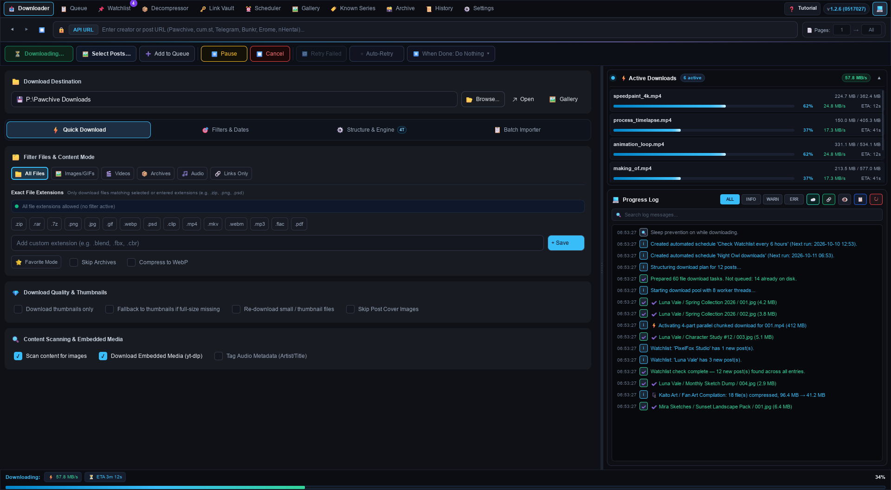
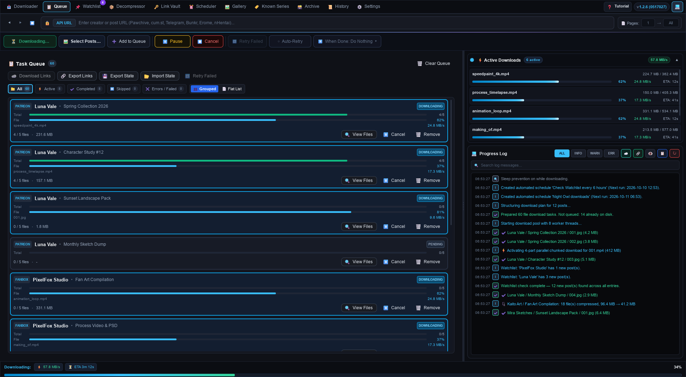
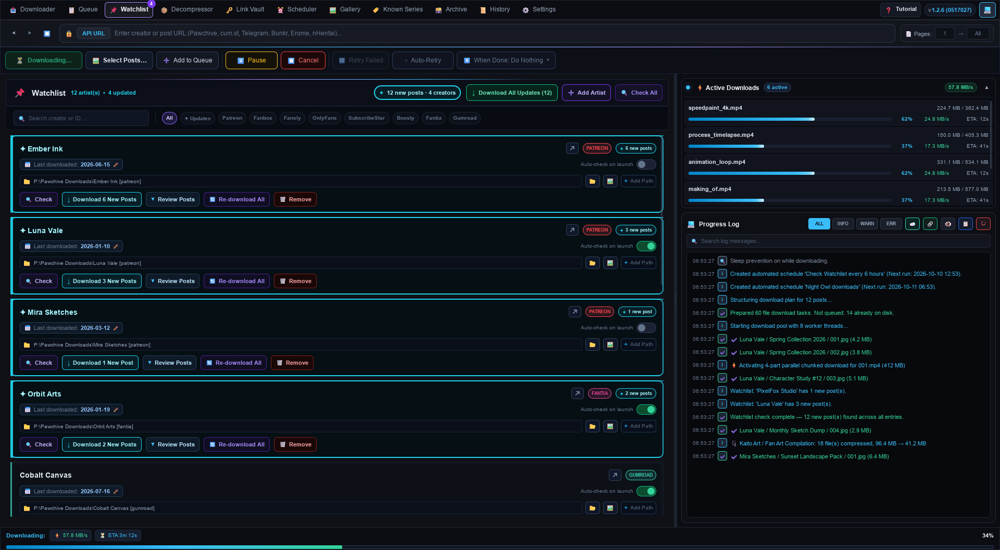
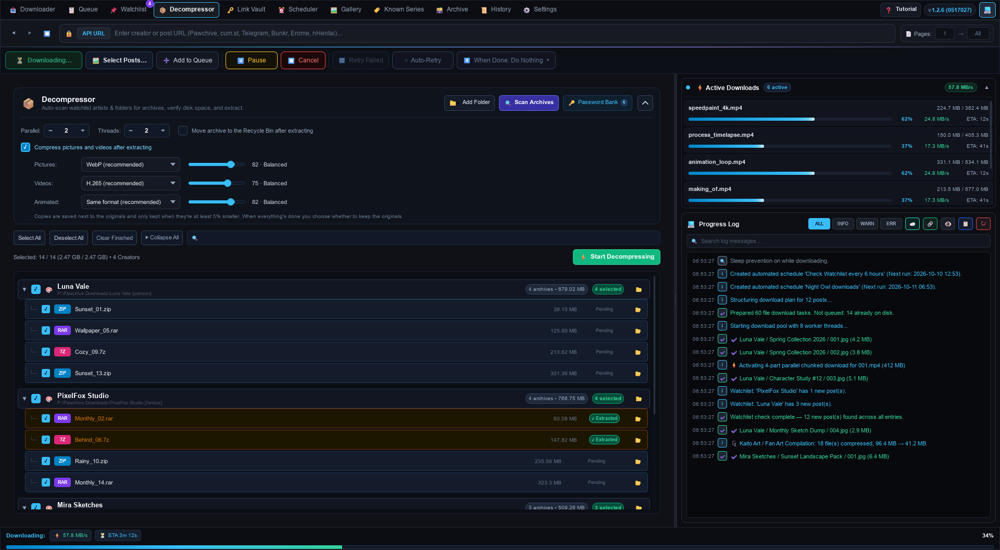
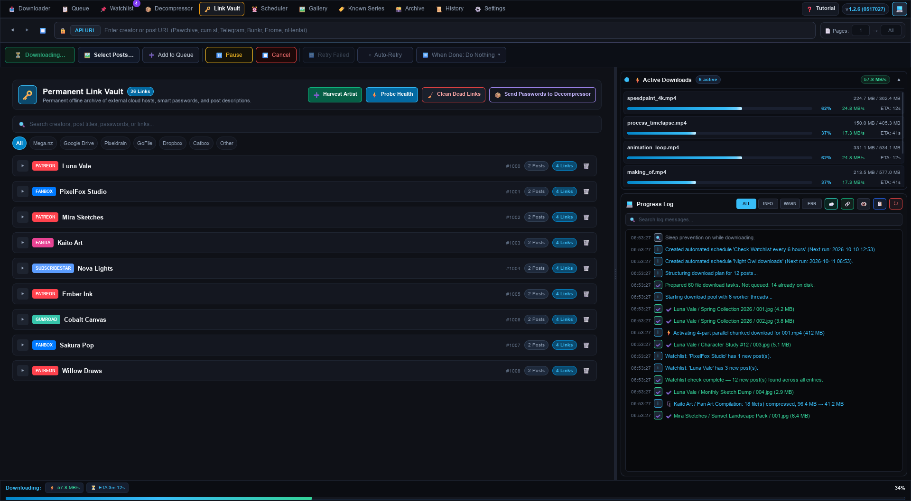
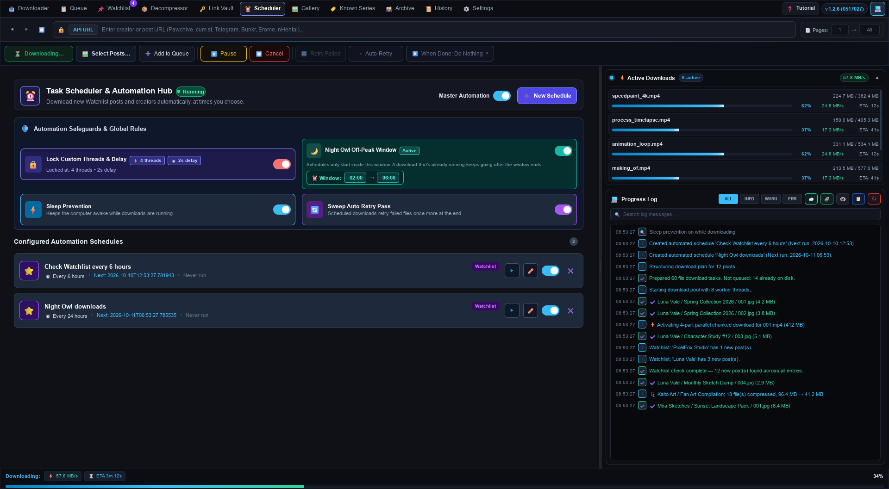
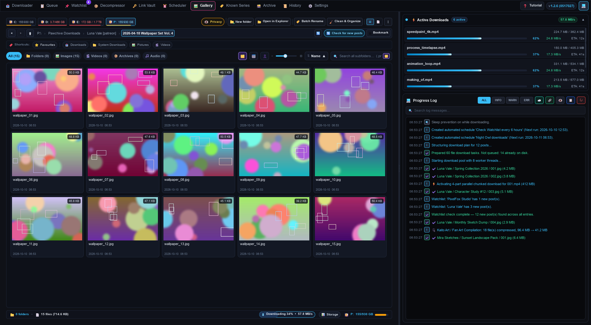
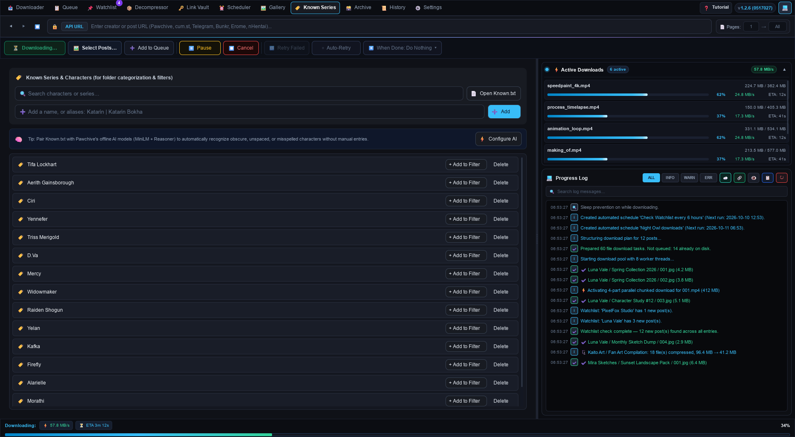
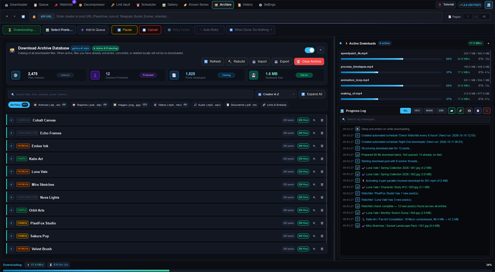
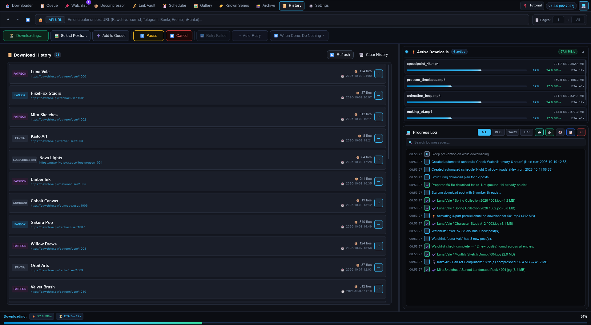

# Pawchive Downloader

<p align="center">
  
</p>

<p align="center">
  <strong>A modern, high-speed desktop media archiver and downloader for Pawchive, Kemono, Coomer, Telegram, and external cloud hosts.</strong><br>
  Built with Python, PySide6, and modern reactive QML.<br>
  <em>Engineered for maximum automation: hands-off scheduled syncing, integrated media gallery, permanent link vaulting, multi-drive overflow, self-healing session recovery, and Telegram channel archiving.</em>
</p>

<p align="center">
  <a href="https://github.com/whyamihere773/Pawchive-Downloader/releases/latest"></a>
  <a href="https://github.com/whyamihere773/Pawchive-Downloader/releases"></a>
  <a href="https://discord.gg/YBrKkzVq8"></a>
  
  
</p>

<p align="center">
  <a href="https://github.com/whyamihere773/Pawchive-Downloader/releases/latest">
    
  </a>
</p>

<p align="center">
  <em>(Portable — no Python or command-line setup required! Just extract and run <code>Pawchive Downloader.exe</code>)</em>
</p>

> 💬 **Need Help, Support, or Want to Chat?**  
> If you run into any issues, have suggestions, or need further help, you can communicate directly with me on our **[Discord Server](https://discord.gg/YBrKkzVq8)**!

---

## 📸 Interface Preview

<p align="center">
  
</p>

<details>
<summary><strong>🖼️ Click to expand more interface screenshots</strong></summary>
<br>











</details>

## ✨ Flagship Highlights (Engineered for Maximum Automation)

> 💡 **Philosophy: Maximum Automation, Minimum Friction**  
> Pawchive Downloader is designed to take the heavy lifting off your hands. You point it at what you want — and it handles the rest: automated schedules, background link harvesting, multi-drive overflow, self-healing recovery, and intelligent file organisation. You stay in control; the app does the work.

- 🖼️ **Built-in Media Gallery & File Explorer:** Dedicated local media manager and lightbox viewer built right into the app. Seamlessly browse downloaded collections, stream full-resolution video with responsive timeline scrub, play audio, and inspect animated GIFs/WebPs without opening external software. Includes instantaneous recursive subfolder search with syntax filters (`ext:png`, character tags), persistent star ratings and favorites tracked across folder moves, up to 25-step undo history for file operations, live folder monitoring, storage usage breakdowns, and a 1-click **Check for Updates** button to grab new creator posts right from the gallery.
- ✈️ **Telegram Channel Downloader & Media Browser:** Download photos, videos, and files directly from public channels, private links, and individual posts (`t.me/...`). Features an interactive visual thumbnail post selector with checkboxes, one-click criteria filtering (dates, media types), effortless QR code / phone login, client-side encrypted session storage, and automated anti-ban safeguards (locked 2-thread concurrency & FloodWait cooldowns).
- 🧹 **Automatic Memory Cleanup Daemon *(WIP)*:** Periodic memory management daemon that continuously monitors process memory, sweeping cyclic objects and reclaiming unused RAM during massive download sessions to keep long-running tasks light and stable.
- 🛑 **Sub-Second Multi-Service Cancellation:** Universal instant abort across multi-part files, child `yt-dlp` video processes, cloud mirrors (Mega, Dropbox, GoFile), and Telegram downloads in less than a second.
- 🎵 **Automatic ID3 Audio Tagging:** Automatically embeds creator as Artist and post title as Track Title on `.mp3`, `.m4a`, `.flac`, `.ogg`, and `.wav` downloads for instant integration with iTunes, Plex, and MusicBee.
- ⏰ **Task Scheduler & Automation Hub:** Create recurring automation schedules to poll your Watchlist for new creator posts, schedule off-peak **Night Owl** download windows, prevent Windows sleep during active jobs, and automatically sweep-retry any rate-limited or dropped files.
- 🖼️ **Interactive Post Selector & Inspector:** Browse, search, and selectively download or queue individual creator posts. Drill down into post descriptions and passwords, pick individual attachments, view files in a fullscreen media Lightbox visualizer, and track real-time file and post selection tallies.
- 🗄️ **Download Archive Database & Verifier:** Dedicated offline database cataloging all downloaded posts and files. Includes a disk verification engine to detect missing files, red/amber visual warning indicators, and a one-click database cleanup flow.
- 🏷️ **Custom Filename Template Builder:** Flexible pattern designer with interactive tag chips (`{artist}`, `{title}`, `{post_id}`, `{date}`, `{file_index}`, etc.), real-time live preview, and filesystem sanitization.
- 🗄️ **Permanent Link Vault & Harvester:** Harvests external cloud links (Mega, Google Drive, Pixeldrain, etc.) and archive passwords from posts *(WIP)* into a permanent offline vault. Run link health checks, prune dead links, sync passwords to the Decompressor with one click, or harvest entire creator histories without downloading files.
- 💾 **Multi-Drive Storage Pools (Auto-Spanning Overflow):** Never suffer "Disk Full" crashes again. Automatically spills downloads to secondary drives or folders when your primary drive reaches its safety margin, preserving creator and post folder hierarchies seamlessly.
- 📌 **Artist Watchlist:** Track followed creators and automatically check for new posts. Features one-click "Download All Updates", an interactive post review drawer with per-post and bulk ignoring, custom download paths per artist, saved per-artist filter settings, and an editable last-downloaded cutoff date with smart auto-normalization.
- 🧩 **Franchise Recognition Engine:** Automatically structures downloaded files into clean creator/franchise folders using an integrated franchise database and fully customisable `Known.txt` rules — no manual sorting needed.
- 📦 **Universal Bulk Decompressor:** Automated scan across downloaded artists, multi-threaded parallel extraction for `.zip`, `.rar`, `.7z`, multi-part archives, disk safety pre-flight checks, creator-organized Password Bank with collapsible sections and emerald active-target highlights, alphabetical artist selector with keyboard jumping, automatic password prompting with wrong-password feedback, password bank auto-sync, and a re-extract confirmation flow for already-extracted archives with amber colour-coding.
- 🛡️ **Zero-Loss Session Recovery:** If the app is closed, crashed, or cancelled mid-download, atomic checkpoints allow instant one-click resumption right where you left off.
- 🔓 **Client-Side Cloud Decryptor & Modern Host Support:** Native AES client-side decryption for Mega folders, Google Drive full trees with live progress, 1-click browser cookie importer, and rebuilt Bunkr 2026 parallel resolution.

<details>
<summary><strong>🔍 Click to explore all features & tools (25+ capabilities)</strong></summary>
<br>

### 📥 Core Downloading & Performance
- ⚡ **Adaptive Multi-Threaded Engine:** Parallel chunked downloads with dynamic concurrency scaling and manual thread-locking.
- 📊 **Active Large File Monitor (≥ 50 MB):** Dedicated real-time monitoring panel displaying individual progress bars, speed, and ETA for large media downloads.
- 🎬 **Embedded Player Downloads:** Auto-updating `yt-dlp` integration grabs videos from Vimeo, YouTube, Streamable, RedGifs, Twitter/X, and more.
- 🛡️ **SSD Stall & Disk Saturation Protection:** Hardened speed estimation engine prevents freeze glitches and auto-pauses gracefully upon out-of-disk space (`WinError 112` / `Errno 28`) without crashing worker threads.
- ✨ **Fluid Newtonian Smooth Scrolling:** Physics-based kinetic momentum scrolling and velocity accumulation deployed across every view, list, panel, and modal in the UI.

### 🗂️ Smart Organization & Filtering
- 🗂️ **Post-Aware Folder Isolation:** When posts share identical titles or dates, each post is isolated into its own folder (`[post_id]`) so generic filenames (`1.png`, `4.png`) never overwrite or collide.
- 🏷️ **Tag-Based Folder Sorting:** Organise downloads by their primary tag into sub-folders (`Artist / Tag / ...`) so related content stays cleanly grouped.
- 🔢 **Sequential File Indexing:** Files are numbered (`001_`, `002_`, ...) to preserve chronological viewing order without relying on filesystem time sorting.
- 🎯 **Advanced Smart Filtering:** Filter by character names, series, keywords, file categories (images, videos, audio, archives), or minimum file size thresholds.
- 📖 **Manga & Comic Order:** Chronologically sequences files and folders (`001 - Title`) so chapters stay in proper sequential order in image viewers.

### 🎨 Local Media Gallery & File Management
- 🖼️ **Integrated Media Player & Lightbox:** Fluid video, audio, and image viewer with timeline scrub, animation decoding, and zoom controls.
- ⭐ **Persistent Favorites & Star Ratings:** Rate files and organize favorites with metadata tracked across disk moves and renames.
- 🔍 **Live Recursive Search & File-Type Filters:** Search deeply nested download directories in real time with batch streaming and syntax filters (`ext:png`, character tags).
- ↩️ **Safety Undo Stack:** Up to 25 steps of instantaneous undo for accidental moves, renames, or copies.
- 🔄 **In-Gallery Creator Sync:** Detects which creator owns the viewed folder and lets you check for and queue new posts in a single click without leaving the gallery.
- 📊 **Per-Folder Storage Analytics:** Live disk breakdown showing file counts, folder hierarchy, and consumed disk space.

### 📊 Auditing, Recovery & Settings
- 📊 **Desktop Completion Reports:** Generates rich visual HTML summaries and plaintext audit reports directly to your Desktop upon download completion (opt-in).
- 📋 **Failed Download Export:** Export a full report of failed files — including direct download links and source post URLs — to a text file for manual auditing.
- 🍪 **1-Click Browser Session Importer:** Extracts authenticated Kemono/Patreon cookies directly from installed browsers without locking open sessions or manual DevTools copying.
- 🌐 **Full 14-Language Localization (i18n):** Instant in-app language switching and real-time dynamically translated console activity logs (English, Chinese, Japanese, Korean, Spanish, French, German, Russian, Portuguese, and more).
- 🔄 **Safe In-App Updater:** Update alerts on launch with a release notes preview, then a dedicated updater window that verifies the download, installs it with automatic rollback if anything fails, and reopens the app. Works for the Windows build, the Linux build and source checkouts.

</details>

---

## 🌐 Supported Platforms & Hosts

### Creator Archives & Portals
- **Pawchive** (`pawchive.pw`)
- **Cum.st** (`cum.st`)
- **Kemono** and **Coomer**: *turned off for now.* Both sites are mostly not working at the moment, so the app
  doesn't use them. Kemono links are offered as the same link on Pawchive (it has the same creators and IDs);
  for Coomer creators, use cum.st. Kemono artists in the Watchlist can be moved to Pawchive in one click.
- **Telegram** (`t.me/...` public channels, private links, and individual media posts)
- *Supported creator services:* Patreon, Pixiv Fanbox, Fantia, Subscribestar, Gumroad, Boosty, Discord, OnlyFans, Fansly, Afdian, DLsite, and more.

### Cloud Drives & Direct Storage
- **Mega** (folders and individual files with automatic AES decryption)
- **Google Drive** (shared files and public folders)
- **Dropbox** (direct download links and auto-extracted archives)
- **GoFile** (direct albums and folders)

### Media Galleries & File Lockers
- **Bunkr**, **Erome**, **nHentai**, **Saint2**, **Pixeldrain**, **Catbox**, **Mediafire**, **SimpCity**

### Video & Stream Embeds
- **YouTube**, **Vimeo**, **Streamable**, **RedGifs**, **Twitter/X**, **Bilibili**, **SoundCloud**, **Dailymotion**

---

## 🚀 Getting Started

### Option A: Pre-compiled Windows Binary (Recommended for most users)

1. Head over to the **[Latest Release](https://github.com/whyamihere773/Pawchive-Downloader/releases/latest)** page.
2. Download `Pawchive-Downloader-v1.2.5-Windows.zip`.
3. Extract the ZIP archive anywhere on your computer.
4. Run `Pawchive Downloader.exe` — that's it!

**On Linux**, download `Pawchive-Downloader-v<version>-Linux-x86_64.tar.gz` instead, extract it, and run `./pawchive`.
The Linux build is made on Ubuntu 22.04, so it runs on any distro with glibc 2.35 or newer (Debian 12+, Fedora 36+, Arch, Mint 21+, openSUSE Tumbleweed…).

---

### Option B: Running from Source (Developers)

Ensure you have **Python 3.10 or newer** installed.

1. **Clone the repository:**
   ```bash
   git clone https://github.com/whyamihere773/Pawchive-Downloader.git
   cd Pawchive-Downloader
   ```

2. **Install dependencies:**
   ```bash
   pip install -r requirements.txt
   ```
   or, with [uv](https://docs.astral.sh/uv/):
   ```bash
   uv pip install -r requirements.txt
   ```
   On Linux distributions that manage the system Python (Arch / CachyOS, Debian 12+, Ubuntu 23.04+, Fedora…),
   `pip install` refuses with *externally-managed-environment*. Use a virtual environment instead:
   ```bash
   python -m venv .venv && source .venv/bin/activate && pip install -r requirements.txt
   # or: uv venv && source .venv/bin/activate && uv pip install -r requirements.txt
   ```
   The in-app updater installs new dependencies the same way (uv when available, otherwise pip).

   *Optional:* offline AI character recognition (Settings → AI & Recognition) needs a few extra packages:
   ```bash
   pip install -r requirements-ai.txt
   ```
   The Windows and Linux downloads already include them.

3. **Run the application:**
   ```bash
   python main.py
   ```

4. **Build a Windows package:**
   ```bash
   python build.py
   ```
   The portable distribution will be output to `dist/Pawchive Downloader/` alongside a compressed release ZIP archive.

---

### Logs

Logs are saved in a `logs` folder next to `Pawchive Downloader.exe`, the Linux `pawchive` binary, or `main.py`:

```
logs/
  v1.2.1/        one file per session (2026-10-02_10-00-00.log); a <session>.crash.log appears only after a hard crash
  updater/       one file per update (2026-10-02_10-05-12 (1.2.1 to 1.3.0).log)
  older/         logs from versions before this layout
```

Each log starts with the app version, edition, system and Python/Qt versions and ends with a "Session ended" line, so a log without one belongs to a session that crashed or was closed by force. Passwords, MEGA keys, proxy logins and your home folder are hidden, so logs are safe to attach to bug reports. Logs are never deleted automatically: **Settings → Storage → Logs** shows their size and has a **Clear logs** button. If the app folder can't be written to, logs go to `%LOCALAPPDATA%\Pawchive Downloader\logs` (Windows) or `~/.local/share/pawchive/logs` (Linux) instead.

### Updating

Pawchive checks for updates on launch. Click **Update now** in the update dialog: the app closes, the updater installs the new version, and the app opens again. Your `config/`, `downloads/`, `logs/`, `data/` folders, virtual environments and any files you added are never touched, and if anything fails the previous version is restored.

The update dialog shows the version you're running and its edition (**Windows build**, **Linux build** or **Source code**):

| Edition | Version shown | How it updates |
| --- | --- | --- |
| Windows / Linux build | `1.2.1` | Downloads the matching release package, checks it against the release's SHA-256, and installs it |
| Source, git clone | `1.2.1 (ad0390c)` | `git fetch` + fast-forward of `main`; if you've edited app files it asks to `git stash` them or skip |
| Source, zip download | `1.2.1 (ad0390c)` | Downloads the exact commit from GitHub and remembers which commit is installed |

Source installs compare their commit with GitHub's `main`, so they're offered an update only when `main` has new commits (shown as *"1.2.1 + 3 new changes"*). A checkout with your own commits on top isn't nagged.

You can also run the updater yourself:
```bash
python updater.py            # check and update this source folder
python updater.py --console  # same, in the terminal (used automatically when no window can open)
```

---

## 🤝 Contributing & Community

Feedback, bug reports, and pull requests are warmly welcome!
- 💬 **Need further help or want to chat?** If you need assistance, have questions, or want to communicate directly with me, feel free to join our **[Discord Server](https://discord.gg/YBrKkzVq8)**!
- **Have a suggestion or found a bug?** Please open an **[Issue](https://github.com/whyamihere773/Pawchive-Downloader/issues)**.
- **Want to add a new host or feature?** Fork the repository, create a feature branch, and submit a **Pull Request**.

---

## 🔍 Tags & Search Keywords

<details>
<summary><strong>🏷️ Click to view indexed tags & keyword aliases</strong></summary>
<br>

- **Kemono:** `kemono`, `kemono.su`, `kemono.party`, `kemono-party`, `kemonoparty`, `kemono party`, `kemono downloader`, `kemono-downloader`, `kemonodownloader`, `kemono scraper`, `kemono ripper`, `kemono archiver`, `kemono party downloader`
- **Coomer:** `coomer`, `coomer.su`, `coomer.party`, `coomer-party`, `coomerparty`, `coomer party`, `coomer downloader`, `coomer-downloader`, `coomerdownloader`, `coomer scraper`
- **Pawchive:** `pawchive`, `pawchive.pw`, `pawchive downloader`, `pawchive-downloader`, `pawchivedownloader`, `pawchive grabber`, `pawchive scraper`, `pawchive archiver`
- **Cum.st:** `cum.st`, `cum-st`, `cumst`, `cum.st downloader`, `cum-st downloader`, `cumst downloader`, `cum-st scraper`, `cumst scraper`, `cum.st grabber`
- **Telegram:** `telegram-downloader`, `telegram downloader`, `telegram channel downloader`, `telegram media downloader`, `telegram media archiver`, `telegram scraper`, `t.me downloader`
- **Cloud & Hosts:** `mega-downloader`, `megadownloader`, `mega downloader`, `mega folder downloader`, `mega decryptor`, `mega decrypter`, `google drive downloader`, `gdrive downloader`, `dropbox downloader`, `gofile downloader`, `bunkr downloader`, `pixeldrain downloader`, `catbox downloader`
- **Patreon & Creator Sites:** `patreon-downloader`, `patreondownloader`, `patreon downloader`, `patreon scraper`, `patreon ripper`, `patreon archiver`, `fanbox-downloader`, `fanboxdownloader`, `fanbox downloader`, `fantia-downloader`, `fantiadownloader`, `fantia downloader`, `subscribestar-downloader`, `subscribestar downloader`, `boosty downloader`, `gumroad downloader`
- **Archiving & Utilities:** `media-downloader`, `mediadownloader`, `media downloader`, `media grabber`, `media archiver`, `data-hoarder`, `datahoarder`, `data hoarder`, `data-hoarding`, `datahoarding`, `data hoarding`, `batch downloader`, `bulk downloader`, `pyside6`, `qml`, `yt-dlp`, `media-gallery`, `gallery`, `image-viewer`

</details>

---

## ⚖️ Disclaimer

This tool is intended strictly for personal archiving and backup purposes. Please respect content creators' terms of service and rights.

